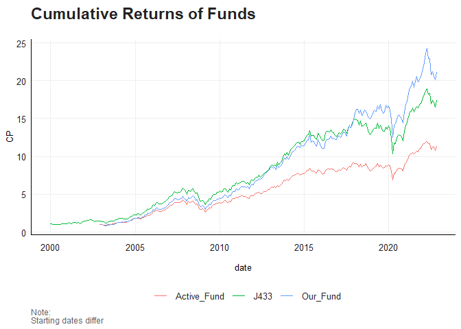
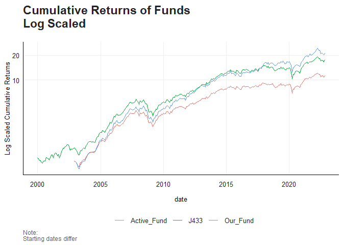
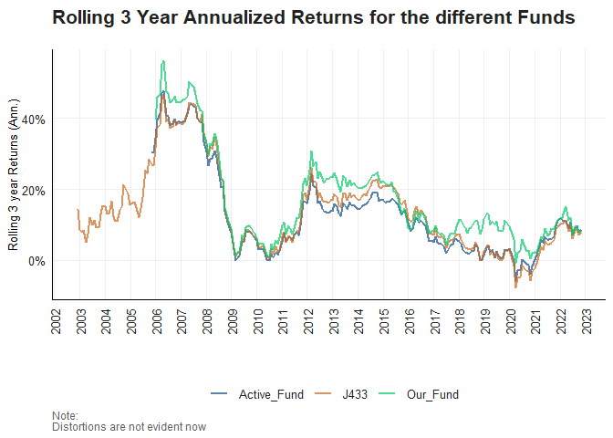
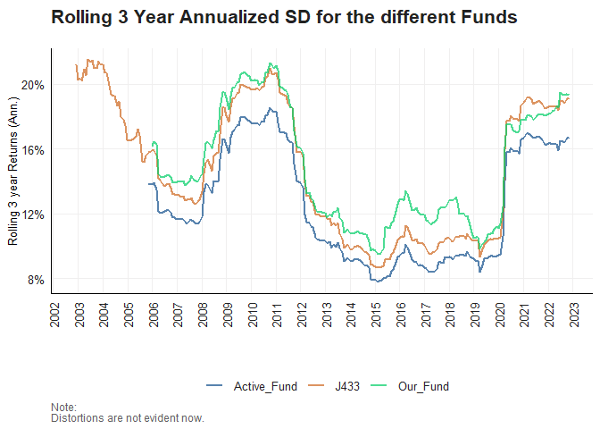

# Financial Econometrics Practical

This is my README for the Financial Econometrics Practical Exam 2022

``` r
#rm(list = ls()) 
#gc() 

library(tidyverse)
```

    ## -- Attaching packages --------------------------------------- tidyverse 1.3.2 --
    ## v ggplot2 3.4.0      v purrr   0.3.4 
    ## v tibble  3.1.7      v dplyr   1.0.10
    ## v tidyr   1.2.0      v stringr 1.4.0 
    ## v readr   2.1.2      v forcats 0.5.1 
    ## -- Conflicts ------------------------------------------ tidyverse_conflicts() --
    ## x dplyr::filter() masks stats::filter()
    ## x dplyr::lag()    masks stats::lag()

``` r
pacman::p_load(cowplot, glue, tbl2xts)

list.files('C:/Users/Cabous/OneDrive/Desktop/22017542_Exam/Questions/Question3/code/', full.names = T, recursive = T) %>% .[grepl('.R', .)] %>% as.list() %>% walk(~source(.))
```

# Question 1: Yield Spreads

## Import Data

``` r
SA_bonds <- read_rds("data/SA_Bonds.rds")

BE_Inflation <- read_rds("data/BE_Infl.rds")

bonds_2y <- read_rds("data/bonds_2y.rds")

bonds_10y <- read_rds("data/bonds_10y.rds")

usdzar <- read_rds("data/usdzar.rds")

ZA_Inflation <- read_rds("data/ZA_Infl.rds")

IV <- read_rds("data/IV.rds")
```

## Compare spreads

``` r
pacman::p_load(fmxdat)

# Sort data and calculate spreads.

SA_Spreads <- SA_bonds %>% 
    
    arrange(date) %>% 
    
    group_by(date) %>% 
    
    mutate("10Yr2Yr" = ZA_10Yr - ZA_2Yr) %>% 
    
    mutate("10Yr3M" = ZA_10Yr - SA_3M) %>% 
    
    mutate("2Yr3M" = ZA_2Yr - SA_3M) %>% 

    ungroup() %>% 
    
    pivot_longer(c("10Yr2Yr", "10Yr3M", "2Yr3M"), names_to = "Spreads", values_to = "Rates") %>% 
    
    filter(date >= as.Date("2000/01/01"))
```

# Plot the spreads

``` r
SA_Spread_plot <- SA_Spreads %>% 
    
    ggplot() +
    
    geom_line(aes(date, Rates, colour = Spreads), alpha = 0.8) +
    
    labs(title = "Yeild Spread in Local Bond Market", 
         
         subtitle = "3 Month, 2 Year and 10 year bond yields",
         
         y = "Yield Spread", x ="") +
    
    fmxdat::theme_fmx() + 
    
    fmxdat::fmx_cols()


fmxdat::finplot(SA_Spread_plot, x.date.type = "%Y%m", x.vert = TRUE)
```



I can confirm that bond yields have since 2020 been the highest in two
decades.

``` r
library(dplyr)
library(tidyr)
pacman::p_load(lubridate)

# Lets combine ZA and BE inflation (Monthly)
# Note: BE starting date (2012-05-07)

BE_Inflation_clean <- BE_Inflation %>% 
    
    arrange(date) %>% 
    
    rename(BE_Inflation = Price) %>% 
    
    select(-Name) %>%  
                  
    filter(date >= as.Date("2012/05/07")) %>% 
    
    mutate(YM = format(date, "%Y%m")) %>%
    
    group_by(YM) %>% 
    
    filter(date == last(date)) %>% 
    
    select(-date) %>% 
    
    ungroup()


ZA_Inflation_clean <- ZA_Inflation %>% 
                  
        arrange(date) %>%
            
        rename(ZAR_Infl = Price) %>% 
            
        select(-Name) %>% 
            
        filter(date >= as.Date("2012/05/07")) %>% 
    
        mutate(YM = format(date, "%Y%m")) %>%
    
        group_by(YM) %>% 
    
        filter(date == last(date)) %>% 
    
        select(-date) %>% 
            
        ungroup() 
        
ZA_BE_Inflation <- BE_Inflation_clean %>% 
    
    inner_join(ZA_Inflation_clean) %>% 
    
    inner_join(.,SA_bonds %>% 
    
    arrange(date) %>% 
    
    group_by(date) %>% 
    
    mutate("10Yr2Yr" = ZA_10Yr - ZA_2Yr) %>% 
        
        filter(date >= as.Date("2012/05/07")) %>% 
    
        mutate(YM = format(date, "%Y%m")) %>%
    
        group_by(YM) %>% 
    
        filter(date == last(date)) %>% 
    
        select(-date, -SA_3M, -ZA_10Yr, -ZA_2Yr) %>% 
            
    ungroup()) 
```

    ## Joining, by = "YM"
    ## Joining, by = "YM"

``` r
ZA_BE_Inflation <- ZA_BE_Inflation %>% 
    
    pivot_longer(c("10Yr2Yr", "BE_Inflation", "ZAR_Infl"),
                 
                 names_to = "Spreads", values_to = "Rates") %>%
    
    mutate(date = ym(YM))

# Plot 

Spread_Infl_plot <- ZA_BE_Inflation %>%
    
    ggplot() +
    
    geom_line(aes(date, Rates, colour = Spreads), alpha = 0.8) +
    
    labs(title = "SA 10 year Spread and Inflation",
         
         y = "Yield Spreads", x ="", 
         
         subtitle = "Includes Inflation, Break-Even 10 Year Inflation and 10/2 year yield spread") +
    
    fmxdat::theme_fmx(title.size = ggpts(25), subtitle.size = ggpts(20)) + 
    
    fmxdat::fmx_cols()

fmxdat::finplot(Spread_Infl_plot, x.date.type = "%Y%m", x.vert = TRUE)
```



# Compare to International Spreads

``` r
#bonds_10y %>% pull(Name) %>% unique()

Names_2yr <- c("Philippines_2yr", "Germany_2yr", "US_2yr")

Names_10yr <- c("Philippines_10Yr", "Germany_10Yr", "US_10Yr")


bonds_2y10y_combine <-  bonds_2y %>% 
    
    arrange(date) %>% 
    
    group_by(date) %>% 
    
    filter(date >= as.Date("2000/01/01")) %>%
    
    filter(Name %in% Names_2yr) %>% 
    
    spread(Name, Bond_2Yr) %>% 
    
    ungroup() %>% 
    
    left_join(., bonds_10y %>% 
                  
    arrange(date) %>% 
    
    group_by(date) %>% 
    
    filter(date >= as.Date("2000/01/01")) %>%
    
    filter(Name %in% Names_10yr) %>% 
    
    spread(Name, Bond_10Yr) %>% 
    
    ungroup())
```

    ## Joining, by = "date"

``` r
bonds_2y10y_spread <- bonds_2y10y_combine %>% 
    
    group_by(date) %>% 
    
    mutate(US_10Yr2Yr = US_10Yr - US_2yr, 
           PHILL_10Yr2Yr = Philippines_10Yr - Philippines_2yr,
           Germany_10Yr2Yr = Germany_10Yr - Germany_2yr) %>% 
    
    ungroup() %>% 
    
    inner_join(.,SA_bonds %>% 
    
    arrange(date) %>% 
    
    group_by(date) %>% 
    
    mutate("SA_10Yr2Yr" = ZA_10Yr - ZA_2Yr) %>% 
    
    filter(date >= as.Date("2000/01/01"))) %>% 
    
    select(date, SA_10Yr2Yr, US_10Yr2Yr,PHILL_10Yr2Yr, Germany_10Yr2Yr) %>% 
    
    pivot_longer(c("US_10Yr2Yr", 
                   "PHILL_10Yr2Yr", 
                   "Germany_10Yr2Yr",
                   "SA_10Yr2Yr"), 
                 names_to = "Spreads", values_to = "Rates") 
```

    ## Joining, by = "date"

``` r
# Plot the spreads

compare_spread_plot <- bonds_2y10y_spread %>% 
    
    arrange(date) %>% 
    
    ggplot() +
    
    geom_line(aes(date, Rates, colour = Spreads), alpha = 0.8) +
    
    labs(title = "Relative Long Term Spreads", 
         y = "Spreads (Yields)", x ="", 
         subtitle = "Includes US, Philippines, Germany and SA") +
    
    fmxdat::theme_fmx(title.size = ggpts(25), subtitle.size = ggpts(18), legend.size = ggpts(15)) + 
    
    fmxdat::fmx_cols()

fmxdat::finplot(compare_spread_plot, x.date.type = "%Y%m", x.vert = TRUE)
```



# Question 2: Portfolio Construction

## Import Data

``` r
T40 <- read_rds("data/T40.rds")

RebDays <- read_rds("data/Rebalance_days.rds")
```

``` r
# Construct Capped Portfolio and Determine Performance for ALSI

reb_ALSI <- T40 %>% 
    
    filter(date %in% RebDays$date) %>% 
    
# Now we have to distinguish rebalances - to create something
# to group by:
    
    mutate(RebalanceTime = format(date, "%Y%B")) %>% 
    
    select(date, Tickers, Return, J200, RebalanceTime) %>% 
    
    rename(weight = J200) %>% 
    
    mutate(weight = coalesce(weight , 0))
  
# Apply Proportional_Cap_Foo to ALSI to get capped return for cap of 10%

Capped_df <- reb_ALSI %>% 
    
    group_split(RebalanceTime) %>% 
    
    map_df(~Proportional_Cap_Foo(., W_Cap = 0.1) ) %>% 
    
    select(-RebalanceTime)
 

ALSI_wts <- Capped_df %>% 
    
    tbl_xts(cols_to_xts = weight, spread_by = Tickers)


ALSI_rts <- T40 %>% 
    
    filter(Tickers %in% unique(Capped_df$Tickers)) %>% 
    
    tbl_xts(cols_to_xts = Return, spread_by = Tickers)


ALSI_wts[is.na(ALSI_wts)] <- 0

ALSI_rts[is.na(ALSI_rts)] <- 0


ALSI_capped <- rmsfuns::Safe_Return.portfolio(R = ALSI_rts, weights = ALSI_wts, 
    lag_weights = T) %>% 
    
    xts_tbl() %>% 
    
    rename(ALSI = portfolio.returns)
```

    ## Warning in Return.portfolio.geometric(R = R, weights = weights, wealth.index =
    ## wealth.index, : The weights for one or more periods do not sum up to 1: assuming
    ## a return of 0 for the residual weights

``` r
# Construct Capped Portfolio and Determine Performance for SWIX

reb_SWIX <- T40 %>% 
    
    filter(date %in% RebDays$date) %>%
    
    mutate(RebalanceTime = format(date, "%Y%B")) %>%
    
    select(date, Tickers, Return, J400, RebalanceTime) %>% 
    
    rename(weight = J400) %>% 
    
    mutate(weight = coalesce(weight , 0))
  
# Apply Proportional_Cap_Foo to ALSI to get capped return for cap of 6%

Capped_df <- reb_SWIX %>% 
    
    group_split(RebalanceTime) %>% 
    
    map_df(~Proportional_Cap_Foo(., W_Cap = 0.06) ) %>% 
    
    select(-RebalanceTime)
 

SWIX_wts <- Capped_df %>% 
    
    tbl_xts(cols_to_xts = weight, spread_by = Tickers)


SWIX_rts <- T40 %>% 
    
    filter(Tickers %in% unique(Capped_df$Tickers)) %>%
    
    tbl_xts(cols_to_xts = Return, spread_by = Tickers)


SWIX_wts[is.na(SWIX_wts)] <- 0

SWIX_rts[is.na(SWIX_rts)] <- 0


SWIX_capped <- rmsfuns::Safe_Return.portfolio(R = SWIX_rts, weights = SWIX_wts, 
    lag_weights = T) %>% 
    
    xts_tbl() %>% 
    
rename(SWIX = portfolio.returns)
```

    ## Warning in Return.portfolio.geometric(R = R, weights = weights, wealth.index =
    ## wealth.index, : The weights for one or more periods do not sum up to 1: assuming
    ## a return of 0 for the residual weights

``` r
# Combine and Plot Performance

capped_indices <- left_join(ALSI_capped, SWIX_capped, by = "date") %>% 
    
    pivot_longer(c("ALSI", "SWIX"), names_to = "Meth", values_to = "returns")

# Calculate Uncapped Return for ALSI
ALSI_wts <- T40 %>% 
    
    filter(date %in% RebDays$date) %>%
    
    mutate(RebalanceTime = format(date, "%Y%B")) %>% 
    
    rename(weight = J200) %>% 
    
    mutate(weight = coalesce(weight , 0)) %>%
    
    select(date, Tickers, Return, weight, RebalanceTime) %>% 
    
    tbl_xts(cols_to_xts = weight, spread_by = Tickers)


ALSI_wts[is.na(ALSI_wts)] <- 0

ALSI_rts[is.na(ALSI_rts)] <- 0

ALSI_capped <- rmsfuns::Safe_Return.portfolio(R = ALSI_rts, weights = ALSI_wts, 
    lag_weights = T) %>% 
    
    xts_tbl() %>% 
    
rename(ALSI = portfolio.returns)

# Calculate Uncapped Return for SWIX
 
SWIX_wts <- T40 %>% 
    
    filter(date %in% RebDays$date) %>% 
    
    mutate(RebalanceTime = format(date, "%Y%B")) %>% 
    
    rename(weight = J400) %>% 
    
    mutate(weight = coalesce(weight , 0)) %>% 
    
    select(date, Tickers, Return, weight, RebalanceTime) %>% 
    
    tbl_xts(cols_to_xts = weight, spread_by = Tickers)


SWIX_wts[is.na(SWIX_wts)] <- 0

SWIX_rts[is.na(SWIX_rts)] <- 0

SWIX_capped <- rmsfuns::Safe_Return.portfolio(R = SWIX_rts, weights = SWIX_wts, 
    lag_weights = T) %>% 
    
    xts_tbl() %>% 
    
rename(SWIX = portfolio.returns)

# Combine and Plot

ALSI_SWIX <- left_join(ALSI_capped, SWIX_capped, by = "date") %>% 
    
    pivot_longer(c("ALSI", "SWIX"), names_to = "Meth", values_to = "Returns")

q2_p3 <- capped_indices %>% 
    
    group_by(Meth) %>%
    
    mutate(Idx = cumprod(1 + returns)) %>% 
    
ggplot() + 
    
geom_line(aes(date, Idx, colour = Meth), alpha = 0.8) + 
    
labs(subtitle = "ALSI capped at 10% and SWIX at 6%", 
    x = "", y = "Cumulative Return") +
    
    fmx_cols() + 
    
fmxdat::theme_fmx(subtitle.size = ggpts(20))


q2_p4 <- ALSI_SWIX %>% 
    
    group_by(Meth) %>%
    
    mutate(Idx = cumprod(1 + Returns)) %>% 
    
ggplot() + 
    
geom_line(aes(date, Idx, colour = Meth), alpha = 0.8) + 
    
labs(subtitle = "Uncapped Index Calculation for ALSI and SWIX", 
    x = "", y = "Cumulative Return") + 
    
    fmx_cols() +
    
fmxdat::theme_fmx(subtitle.size = ggpts(20))

plot_grid(finplot(q2_p3), finplot(q2_p4), labels = list(title = "Comparing Capped and Uncapped returns of ALSI and SWIX"), label_size = ggpts(30), align = "h")
```


